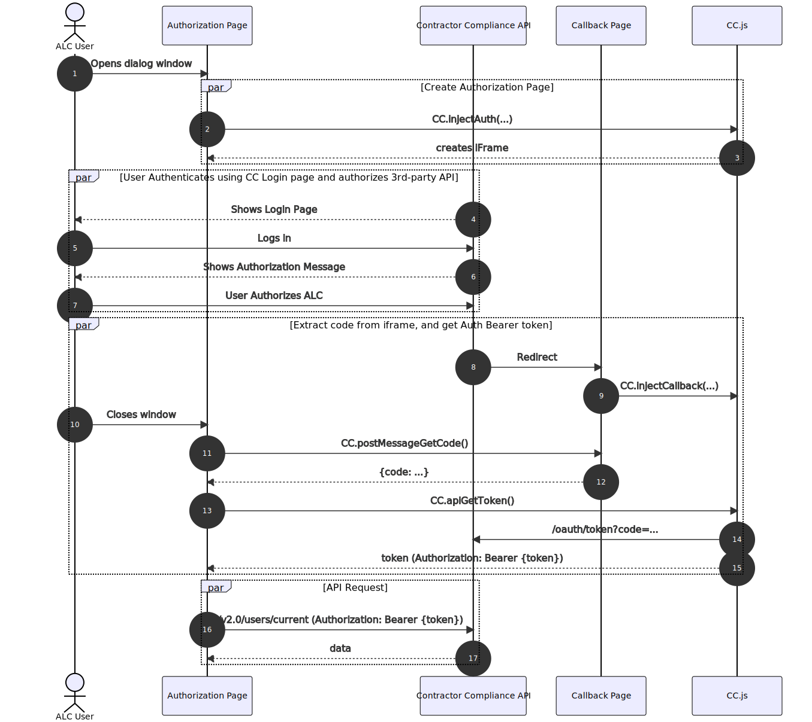

# CC.js Project

## Introduction

This project is used to demonstrate how to use CC.js to allow a user to authorize a 3rd-party API.

## How It Works

To make it easier for one of our hiring org / contractors to utilize our API, `CC.js` has been created to assist with the authorization process.

### Authorization Flow

Authorization is completed in the following steps:

1. `GET /oauth/authorize`: User authorizes the 3rd party to access CC data. Returns access *code*
2. `POST /oauth/token`: Get an access *token* using the code. Use the token in the `Authorization: Bearer {token}` header.



#### /oauth/authorize

The first step is to make make a `GET` request to our API at the following URL: `https://api.contractorcompliance.io/oauth/authorize?...`

You will need to pass in the following url params:

```json
{
    "client_id": "{client id}",
    "redirect_uri": "{redirect url}",
    "response_type": "code",
    "scope": "*",
    "state": "{state}",
}
```

```
curl --location --request GET "https://api.contractorcompliance.io/oauth/authorize?client_id={client_id}&redirect_uri={redirect_uri}&response_type=code&scope=*&state={state}"
```

* `client_id`: The ID number obtained when setting up the new `passport:client`. See [Server Setup](#server-setup).
* `redirect_uri`: The URL that the request will redirect to once the user has logged in, and approved / rejected the authorization request. This must match the redirect url that the passport client uses.
* `{state}` can be a random string. Its used to verify on the client side that the server returned the correct response.

#### /oauth/token

<mark style="background-color:red">
TODO: Write this section
</mark>

## Server Setup

In order to setup the API, we need to create a passport client on the server. Run the following command to create the client:

```bash
php artisan passport:client \
    --public
    --name="CLIENT NAME"
    --redirect_url="REDIRECT URL"
```

<mark>
NOTE
: Copy the client id and secret. You will need these later.
</mark>

## Client Setup

The client will need 2 pages: The Authorization page, and Callback page.

* Authorization Page: The page that holds the dialog window.
* Callback Page: The page that the Contractor Compliance API can redirect to once the user has logged in and authorized the 3rd-party application to utilize their Contractor Compliance data.

### Authorization Page

To setup the authorization page, you will need to have an element with the id `callback-iframe` located inside of your dialog window.

```html
<div style="height: 30em" id="callback-iframe">
</div>
```

When the page loads, run the following javascript. This will inject an iframe window to complete the authentication and authorization.

```js
CC.injectAuth(
    {clientId},
    {clientSecret},
    {redirect}
);
```

* `clientId`: ID Number provided by Contractor Compliance
* `clientSecret`: Secret string provided by Contractor Compliance
* `redirect` the url for the callback page.

The callback page should inform the user to close the dialog window. Once the window is closed, run the following command to obtain the Auth Bearer token:

```js
CC.postMessageGetCode();
```

### Callback Page

The callback page is the page that the API will redirect the user to inside the iframe. This page should run a javascript command, and tell the user that they can close the dialog window now.

Run this code when the callback page loads:

```js
CC.injectCallback(
    {clientId},
    {redirect}
);
```

---

## Project Start

```bash
yarn install && yarn serve
```